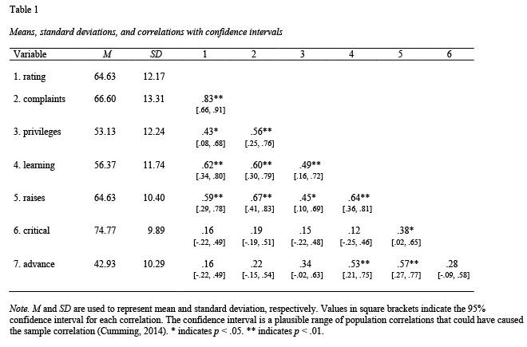
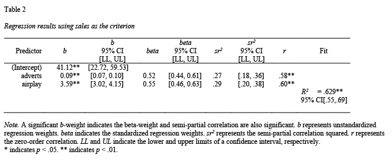
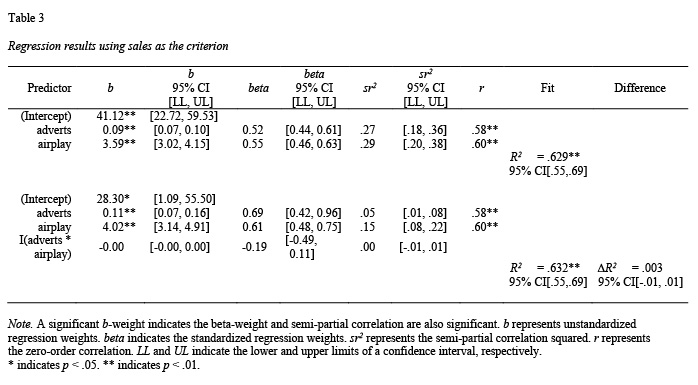
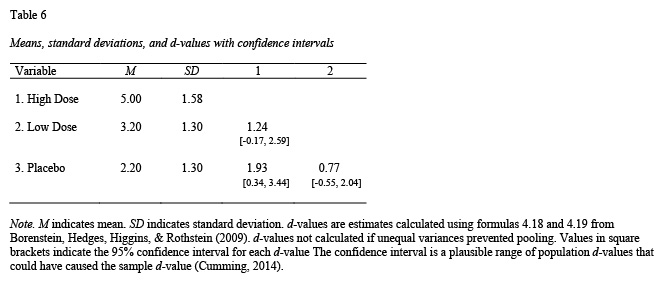
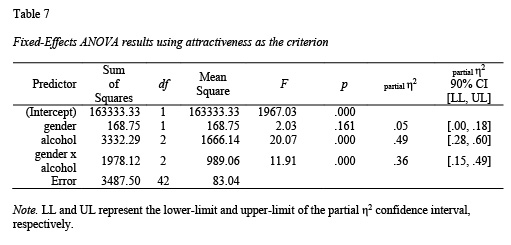
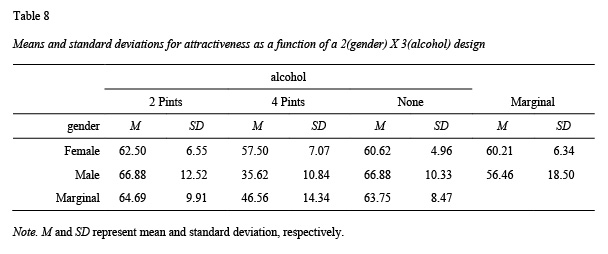
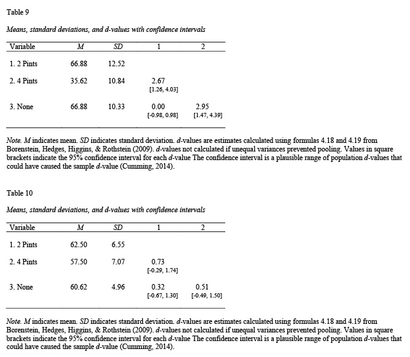

# apaTables
Development version of apaTables R package. Current stable version is on the CRAN, see 

Number of CRAN Downloads: 


### Install Stable CRAN Version
install.packages("apaTables",dep=T)

library(apaTables)

### Install Development Version
install.packages("devtools")

devtools::install_github("dstanley4/apaTables")

library(apaTables)


##Context
Reprodubility refers to the extent to which the numbers reported in a paper can obtained by others using the original data and analysis scripts. Recent research has revealed a problem with the reproducibility of analyses in many fields. For example, in psychology Nuijten et al. (2015) found that in 50% of articles there was at least once instance of a reported test statistic (e.g., *t*(24)=22.71) being inconsistent with the reported *p*-value (e.g., *p* = .0023). This inconsistency rate suggests there is a major problem with reproduciblity in the psychological literature.

My objective in creating the **apaTables** package was to automate the process through which tables are created from analyses when using R. Using **apaTables** ensures that the tables in your manuscript are reprodubile. 

Although a number of table generation packages exist for R they are typically not viable for psychology researchers because of the need to report results in style required by the [American Psychological Association](http://www.apa.org); that is, [APA Style](http://www.apastyle.org/products/asc-landing-page.aspx). Consequently, **apaTables** creates [Microsoft Word](https://products.office.com/en-ca/word) documents (.doc files) that contain tables that conform to APA Style. 

In many cases it would would be necessary to execute additional R commands to obtain all of the statistics needed for an APA Style table. For example, if conducting a regression using the **lm** command the unstandardized regression (i.e., b) weights are reported. Additional commands are needed to obtain standardized (i.e., beta) weights. **apaTables** automatically executes these additional commands to provide information complete **apaTables** in Microsoft Word .doc format^[Technically the tables are in .rtf format. But you should end all files with .doc; this will ensure they are automatically loaded by Microsoft Word].

Additionally, the [American Statistical Association](http://www.amstat.org) recently release a [position paper](https://www.amstat.org/newsroom/pressreleases/P-ValueStatement.pdf) on the use of *p*-values in research. A component of that statement indicated that "*Scientific conclusions and business or policy decisions should not be based only on whether a p-value passes a specific threshold.*" The Executive Director of the [ASA](http://www.amstat.org) suggested that [confidence intervals should used to interpret data](http://retractionwatch.com/2016/03/07/were-using-a-common-statistical-test-all-wrong-statisticians-want-to-fix-that/). This statement is consistent with 1999 [position paper](http://www.apa.org/science/leadership/bsa/statistical/tfsi-followup-report.pdf) from the APA Task Force on Statistical Inference. Consequently, the current version of **apaTables** indicates signficance using stars but more importantly reports confidence intervals for the reported effect sizes.

## Correlation table
Correlation tables can be constructed using the **apa.cor.table** function. The constructed table includes descriptive statistics (i.e., mean and standard deviation) for each variable and a confidence interval for each correlation. 

The **apa.cor.table** function creates a correlation table with confidence intervals based on a data frame; see Figure 1. The confidence intervals can be suppressed but are on by default.


```{r,eval=FALSE}
library(apaTables)
apa.cor.table(attitude, filename="Table1_APA.doc", table.number=1)
```

The resulting table is illustrated in Table 1. If confidence intervals are not desired they can be omitted by using the argument show.conf.interval=FALSE in **apa.cor.table** calls.



## Regression table (1 block)

Regression tables can be constructed using the **apa.reg.table** function. The constructed table includes the understandardized regression coefficient (*b* with CI), standardized regression coefficient (*beta* with CI), semi-partial correlation squared ($sr^2$ with CI), the correlation ($r$), and the overall fit of the model (indexed by $R^2$ with CI). The album sales data set from Field et al. (2012) is used to illustrate the **apa.reg.table** function.

## Basic regression table
The **apa.reg.table** function creates a regression table with confidence intervals based on lm output; see Table 2.

```{r,echo=TRUE,eval=FALSE}
library(apaTables)
basic.reg <- lm(sales ~ adverts + airplay, data=album)
apa.reg.table(basic.reg, filename="Table2_APA.doc", table.number=2)
```


##Blocks regression table
In many cases, it is more useful for psychology researchers to compare the results of two regression models with common variables. This approach is known to many psychology researchers as block-based regression (likely due to the labeling used in popular software packages). Using regression to "control" for certain variables (e.g., demographic or social economic variables) is a common use case. In this scenario, the researcher conducts a regression with the "control" variables that is referred to as *block 1*. Following this, the researcher conducts a second regression with the "control" variables and the substantive variables that is referred to as *block 2*. If *block 2* accounts for significant variance in the criterion above and beyond *block 1* then substantive variables are deemed to be meaningful predictors. 

A second approach common use of block-based regression in psychology is testing for continuous-variable interactions. Consider a scenario in which a researcher is testing for an interaction between two continous variables and two regressions are conducted. The first regression includes the two predictors of interest (*block 1*). The second regression includes the two predictors of interest as well as their product term (*block 2*). If *block 2* accounts for significant variance in the criterion above and beyond *block 1* an interaction is deemed to be present. Admittedly interactions could be tested in a single regression; however, using a block-based regression for this analysis is common in psychology. The example below examines whether advertisements and amount of airplay for a song interact to predict album sales. The resulting table is presented in Figure 3. Although this example only uses two blocks, note that any number of blocks can be used with the **apa.reg.table** function. As well, if the predictors in any of the blocks are a product-term, the zero-order correlation will be omitted from the output to prevent interpretation errors common in psychology.

The **apa.reg.table** function allows for multiple (i.e., more 2 or more) blocks as per below; see Table 3.

```{r,echo=TRUE,eval=FALSE}
library(apaTables)
block1 <- lm(sales ~ adverts + airplay, data=album)
block2 <- lm(sales ~ adverts + airplay + I(adverts*airplay), data=album)
apa.reg.table(block1, block2, filename="Table3_APA.doc", table.number=3)
```



## 1-way ANOVA and d-value tables

There are three function in apaTables that are helpful for 1-way ANOVAs (**apa.anova.table**, **apa.1way.table**, and **apa.d.table**). All three are illustrated below. First, however, the ANOVA must be conducted - I do so using the Viagra data set from Field et al. (2012). When conducting an ANOVA in R using the lm command you must ensure your independent variables are R factors and that contracts are set correctly. 

```{r,echo=TRUE,eval=FALSE}
options(contrasts = c("contr.sum", "contr.poly"))
lm_output <- lm(libido ~ dose, data=viagra)
```

The **apa.anova.table** function creates a 1-way ANOVA table based on lm_output; see Table 4.
```{r,echo=TRUE,eval=FALSE}
library(apaTables)
apa.anova.table(lm_output,filename="Figure4_APA.doc",table.number = 4)
```


The **apa.1way.table** function creates a table with the mean and sd for each cell; see Table 5.
```{r,echo=TRUE,eval=FALSE}
apa.1way.table(iv=dose,dv=libido,data=viagra,filename="Figure5_APA.doc",table.number = 5)
```


The **apa.d.table** function show a d-value (with confidence interval) for each paired comparison; see Table 6.
```{r,echo=TRUE,eval=FALSE}
apa.d.table(iv=dose,dv=libido,data=viagra,filename="Figure6_APA.doc",table.number = 6)
```



## 2-way ANOVA tables
The 2-way example is based on the goggles data set from Field et al. (2012). As before, when conducting an ANOVA in R using the lm command you must ensure your independent variables are R factors and that contracts are set correctly. 

```{r,echo=TRUE,eval=FALSE}
options(contrasts = c("contr.sum", "contr.poly"))
lm_output <- lm(attractiveness ~ gender*alcohol, data=goggles)
```

The **apa.anova.table** function creates a 2-way ANOVA table based on lm_output; see Table 7.

```{r,echo=TRUE,eval=FALSE}
library(apaTables)
apa.anova.table(lm_output,filename="Figure7_APA.doc",table.number = 7)
```



The **apa.2way.table** function creates a table with the mean and sd for each cell; see Table 8. Marginal means can also be requested -- see the help file (?apa.2way.table).

```{r,echo=TRUE,eval=FALSE}
apa.2way.table(iv1=gender,iv2=alcohol,dv=attractiveness,data=goggles,filename="Figure8_APA.doc",table.number = 8)
```



You can use the dplyr package to conducted paired comparisons within each gender again using **apa.d.table**; see Tables 9 and 10.

```{r,echo=TRUE,eval=FALSE}
library(apaTables)
library(dplyr)
goggles.men   <- filter(goggles,gender=="Male")
goggles.women <- filter(goggles,gender=="Female")

apa.d.table(iv=alcohol,dv=attractiveness,data=goggles.men,filename="Table9_APA.doc",table.number = 9)
apa.d.table(iv=alcohol,dv=attractiveness,data=goggles.women,filename="Table10_APA.doc",table.number = 10)
```




##References

Field, A., Miles, J., Field, Z. *Discovering statistics using R*.
Sage: Chicago.

Nuijten, M. B., Hartgerink, C. H. J., van Assen, M. A. L. M., Epskamp, S., & Wicherts, J. M. (2015). The prevalence of statistical reporting errors in psychology (1985-2013). *Behavior Research Methods*. [http://doi.org/10.3758/s13428-015-0664-2](http://doi.org/10.3758/s13428-015-0664-2)


